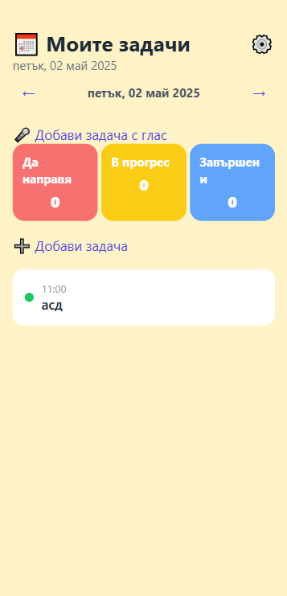
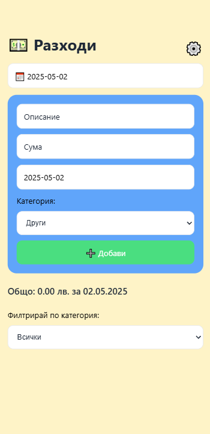

# 🤖 AI Organizer — Todo • Shopping • Expenses

**An AI-powered productivity app** built with **React Native + Expo**, combining tasks, shopping lists, and expense tracking — all controllable with voice commands like:

> 🗣️ _"Remind me to take my pills at 17:00."_

---

## 🧠 Features

- ✅ **Smart Task Manager** — add, mark and manage your todos
- 🛒 **Shopping List** — organized and editable grocery tracker
- 💰 **Expenses Tracker** — log and categorize your daily spendings
- 🗣️ **Voice Commands** _(planned AI/NLP feature)_
- 🌗 **Light / Dark Theme** toggle
- 📅 **Calendar-based overview** of expenses

---

## 📱 Screenshots


| Tasks | Shopping | Expenses |
| ---------------------------------- | ------------------------------------- | ------------------------------------- |
|  |  |  |

> _(Place these in `/screenshots` folder in the root of your project.)_

---

## 🚀 Getting Started

To run the project locally:

```bash
git clone https://github.com/levski1914/AI-Todo-Shopping-Expenses.git
cd AI-Todo-Shopping-Expenses
npm install
npx expo start
```
